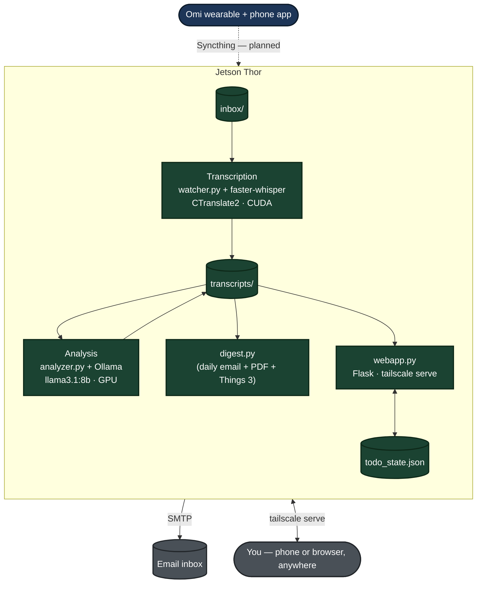

# Omi → Jetson Thor: A Fully Local AI Memory Pipeline

## What is an Omi?

An Omi wearable is a small, orb-shaped AI device created by the tech startup Based Hardware. It functions as a hands-free, wearable AI companion and "second brain" designed to record, transcribe, and summarize your conversations and daily activities.

- How it is worn: The tiny device can be worn discreetly around the neck as a necklace or clipped to your clothing.
- Key features: The wearable continuously listens to your voice and surroundings. The companion app (which runs on your phone or desktop) transcribes your conversations in real-time, generates summaries, highlights action items, and acts as a chat interface that remembers what you've heard or discussed.
- AI integrations: It connects to other services to automate tasks, such as sending emails, drafting notes, translating languages, or saving information directly to Google Drive.
- Privacy and Open Source: One of Omi's main selling points is its focus on data ownership. The device and software are completely open-source, allowing you to choose whether your data stays locally on your phone, is stored on your own self-hosted server, or goes to their secure cloud.

## What this project is

This is a self-hosted replacement for the Omi wearable's normal cloud
pipeline. Omi's official app streams your audio to Omi's servers, where a
cloud LLM turns it into summaries, to-do lists, and searchable notes. This
project gets the same *value* — automatic transcription, structured
summaries, speaking-style coaching, and an always-current dashboard of your
conversations — without any of that audio or text ever leaving your own
hardware.

Everything runs on a single NVIDIA Jetson Thor: the speech-to-text model,
the language model that summarizes it, and the code that ties it all
together. No cloud API calls, no third-party servers, nothing billed
per-request. Remote access (the web dashboard, SSH) goes over Tailscale — a
private encrypted mesh network between your own devices, never the public
internet.

**GitLab project:** `gl-demo-ultimate-efranklin/thor-training`
**Known issues** are tracked as real GitLab issues (see the Known Issues
section below) rather than just code comments, going forward.

## System architecture (how it actually runs)



🟢 **Dark green: built, tested, working end-to-end** on real hardware with
real recordings — including getting past several hardware-specific bugs
unique to being early adopters of very new NVIDIA silicon (see the
phase-by-phase notes below).

🔵 **Dark blue: designed and documented, blocked on hardware** — the Omi
wearable hasn't shipped yet, so syncing hasn't been executed for real, only
planned. Everything downstream of it has been validated using
manually-recorded test audio dropped straight into the inbox folder, standing
in for what Syncthing will eventually deliver automatically.

Two things worth calling out about this design:

- **Nothing in this diagram is triggered manually except the "You" node.**
  Syncthing reacts to filesystem events (not a schedule), the watcher reacts
  to new files instantly, and the digest fires on a daily timer. The webapp's
  refresh button is the *only* on-demand action anywhere in the system — it
  doesn't send anything anywhere, it just asks "what do you currently have."
- **The webapp is reachable from anywhere without exposing anything
  publicly.** `webapp.py` binds to `127.0.0.1` only; `tailscale serve` makes
  it reachable over your private Tailscale network (the same one SSH
  already uses), with real HTTPS, and zero public internet exposure.

## Key terms and technologies used here

**Omi** — the open-source AI wearable this project is built around (MIT
licensed). Normally pairs with a phone app that streams audio to Omi's
cloud for processing; here we intercept before that cloud step.

**Syncthing** — an open-source file-synchronization tool that syncs folders
directly between devices on the same network, with no cloud server in the
middle. Event-driven (reacts to file changes instantly), not scheduled.

**Jetson Thor** — the physical NVIDIA computer everything in this project
runs on. A compact "edge AI" device: a real GPU and 128GB of unified memory,
built for running AI workloads locally instead of in a data center.

**CUDA** — NVIDIA's platform for running general-purpose computation on the
GPU rather than the CPU. Both transcription and analysis depend on it for
speed; without it, everything here would still work, just 10-20x slower.

**cuDNN** — NVIDIA's library of GPU-accelerated neural network building
blocks, built on top of CUDA.

**CTranslate2** — a high-performance inference engine for Transformer
models. Compiled from source specifically for Thor's brand-new GPU
architecture, since no prebuilt version existed anywhere at build time.

**faster-whisper** — a CTranslate2-based wrapper around OpenAI's Whisper
speech-to-text model. "Faster" because CTranslate2's engine is
significantly quicker than the original reference implementation.

**Whisper** — OpenAI's speech-to-text model. Converts recorded voice into
text.

**Docker / container** — packaging software with its exact dependencies so
it runs consistently regardless of what else is on the machine. Keeps this
pipeline's Python/CUDA environment from ever colliding with separate
robotics projects on the same Thor.

**NVIDIA Container Runtime** — the plumbing that lets a Docker container
see and use the GPU. Required `NVIDIA_VISIBLE_DEVICES` and
`NVIDIA_DRIVER_CAPABILITIES` set explicitly on this hardware — undocumented
at the time, found through direct testing.

**MPS (Multi-Process Service)** — NVIDIA's tool for sharing one GPU across
multiple processes with a soft cap. Tried here to leave headroom for
robotics work, then **deliberately disabled** after confirming it causes
Ollama's model runner to hang indefinitely on this hardware — a real driver
bug, not a config mistake. The pipeline now relies on default CUDA
time-slicing instead, which is fine given how brief/bursty its actual GPU
usage is.

**Ollama** — runs large language models locally, serving them over a local
API. Needed a manual systemd override on this hardware to force GPU use —
its install script didn't recognize this JetPack version and silently fell
back to CPU otherwise.

**LLM (Large Language Model)** — the model producing structured summaries
and coaching feedback. Currently `llama3.1:8b`.

**Flask** — a lightweight Python web framework, used for the on-demand
dashboard (`webapp.py`). Chosen for minimal resource footprint — this
project's "don't overburden the Thor" constraint, since it needs to coexist
with separate, more GPU-intensive robotics work.

**Tailscale** — a private mesh network (built on WireGuard) between your
own authenticated devices. Used for both SSH and the web dashboard —
reachable from anywhere with internet, never exposed to the public internet
at all. `tailscale serve` specifically exposes a `localhost`-only web
service to your tailnet with real HTTPS, without changing how that service
binds at all.

**WeasyPrint** — generates the digest's PDF attachment. Chosen over the
more commonly-used `wkhtmltopdf` after directly testing both: wkhtmltopdf
converted the digest's table-of-contents links into broken external file
references, while WeasyPrint produced genuine, verified-working internal
PDF navigation.

**watchdog** — the Python library detecting new files in a folder
instantly, without polling on a timer.

**systemd** — Linux's service manager. Keeps Ollama, the watcher, the
digest timer, and the webapp running persistently, restarting them
automatically on crash or reboot.

## Known issues

Tracked as real GitLab issues going forward, not just code comments:

- **[#1](https://gitlab.com/gl-demo-ultimate-efranklin/thor-training/-/issues/1)
  — Things 3 export only imports one to-do instead of all items.** The
  `things:///add-json` link builds a JSON array of every action item, but
  only the first one ends up imported. Root cause not yet confirmed.
- **[#2](https://gitlab.com/gl-demo-ultimate-efranklin/thor-training/-/issues/2)
  — Mystery "•••" collapsed-content indicator** appearing mid-list in at
  least one Gmail-rendered digest email. Message-size clipping and bad
  source data have both been ruled out; root cause still unknown, needs
  Gmail's raw "Show original" source to investigate further.

## Phase-by-phase: what each step is trying to accomplish

### Phase 0 — Find where the phone actually stores recordings
**Goal:** confirm exactly where the Omi app writes raw audio files on the
phone, and in what format. **Status: blocked on hardware.** `adb`
investigation plan is documented and ready to run the moment the wearable
arrives.

### Phase 1 — Get audio from the phone to the Thor, automatically
**Goal:** zero manual action, ever — audio should sync itself the moment
both devices share a network. **Status: blocked on hardware**, mechanism
(Syncthing, one-directional Send-Only/Receive-Only pairing) fully designed.
Worth noting: Syncthing is event-driven, not scheduled — there's no
"cadence" to configure, it reacts to new files continuously. Extending this
over Tailscale (so sync works from anywhere, not just home Wi-Fi) is a
natural next step, and — like everything else in this project — testable
today with synthetic files rather than needing real hardware first.

### Phase 2 — Notice new audio and hand it off for processing
**Goal:** a background process that's always watching, robust to
in-progress file transfers, survives crashes/reboots. **Status: done.**
`watcher.py`, running as a systemd-managed Docker container.

### Phase 3 — Turn audio into text
**Goal:** accurate, fast, GPU-accelerated, entirely local transcription.
**Status: done** — the hardest engineering lift in this project, since
Thor's GPU architecture was new enough that no prebuilt software anywhere
supported it. Required: finding the correct CUDA repo for this hardware
(NVIDIA's generic public repo doesn't carry it), patching around a CMake
architecture-lookup table that predates this GPU's existence, and clearing
a Python packaging policy (PEP 668). All documented inline in
`docker/Dockerfile`.

### Phase 4 — Turn the transcript into something useful
**Goal:** title, summary, category, action items (including appointments
and reminders, with due dates parsed where mentioned), and key facts —
matching the value Omi's cloud AI would produce. **Status: done.**
`analyzer.py` + Ollama, using JSON-mode output for reliably structured
results. Getting Ollama onto the GPU on this hardware needed a manual
systemd override; MPS had to be disabled entirely after it was found to
break Ollama's GPU discovery.

### Phase 5 — Surface it without having to go looking
**Goal:** a daily digest that's actually pleasant to read, not just a data
dump. **Status: done**, and grew well beyond the original scope:
- HTML email with visual checkboxes and color-coded categories (plain-text
  fallback included for non-HTML clients)
- A genuinely clickable table of contents **in the attached PDF**
  (WeasyPrint) — the email body's own jump-links are included as a bonus
  but not relied on, since in-email anchor navigation is
  well-documented as unreliable across clients (Gmail included)
- **Things 3 export** as a separate HTML attachment, not an inline button —
  Gmail and Proton Mail both strip `href`s using non-standard URL schemes
  from inline links, a client-side sanitization behavior, not something
  fixable in the email itself. Opening a downloaded attachment sidesteps it
  entirely, since it renders outside any webmail's live sanitizer.
- Optional SMTP email delivery, credentials kept in a git-ignored
  `.env.digest` file, never committed
- A "Speaking Style Feedback" section (see Phase 6) when coaching was run
  that day — grouped by the conversation's own date, not whenever the
  coaching script happened to be run

### Phase 6 — Speaking style coaching
**Goal:** pace, filler-word, and hedging-language feedback to help
articulate more clearly — the kind of coaching a human speech coach might
give, grounded in real transcript data. **Status: done.** Deliberately
on-demand (`speech_coach.py`), not run automatically on every recording,
since reviewing speaking style makes sense for a deliberate practice
recording, not a casual to-do-list voice memo. Combines:
- **Free, deterministic metrics** (`speech_metrics.py`): words-per-minute,
  pause locations/durations, and filler-word frequency — all computed from
  data Whisper already produces, no new dependencies or audio
  re-processing
- **LLM-based qualitative feedback**, grounded in those numbers — specific
  strengths, areas to improve (each with an actual transcript quote and a
  concrete alternative phrasing), pace commentary, and an overall take

### Phase 7 — On-demand web dashboard
**Goal:** view today's data from anywhere — not just at home, not waiting
for the end-of-day email — with a simple refresh button, plus something
email fundamentally can't do: **real, functioning checkboxes** that
actually persist. **Status: done.** `webapp.py` (Flask) + `todo_state.py`
(a small persisted overlay tracking which to-dos are checked off, kept
separate from the read-only LLM output) + `tailscale serve` for remote
access without any public exposure. Deliberately lightweight — this only
reads existing JSON files off disk, no GPU/LLM work, negligible resource
cost at rest, safe to run continuously alongside robotics work on the same
device.

## Directory layout on the Thor

```
/home/<you>/
├── projects/
│   └── thor-training/                <- CODE (this repo)
│       ├── pipeline/                  <- core: transcription + analysis (self-contained)
│       │   ├── config.py
│       │   ├── watcher.py
│       │   ├── transcribe.py
│       │   ├── analyzer.py
│       │   ├── prompts.py
│       │   ├── data_store.py         <- shared data-loading, used by webapp/digest/speech_coach too
│       │   └── integrations.py       <- Things 3 export, date parsing
│       ├── webapp/                    <- Phase 7: on-demand dashboard
│       │   ├── webapp.py
│       │   └── todo_state.py         <- persisted checkbox state
│       ├── digest/                    <- Phase 5: daily email/PDF digest
│       │   └── digest.py
│       ├── speech_coach/              <- Phase 6: on-demand speaking-style coaching
│       │   ├── speech_metrics.py     <- free deterministic metrics
│       │   └── speech_coach.py
│       ├── systemd/                   <- all .service / .timer unit files
│       │   ├── omi-watcher.service
│       │   ├── webapp.service
│       │   ├── digest.service
│       │   └── digest.timer
│       ├── docker/
│       │   ├── Dockerfile
│       │   ├── docker-compose.yml
│       │   ├── entrypoint.sh
│       │   ├── requirements-docker.txt
│       │   └── .env.example
│       ├── analysis/
│       │   └── analyze.py            <- manual CLI for testing prompt changes
│       ├── requirements.txt           <- host-side (webapp/digest) deps
│       ├── LICENSE
│       ├── .dockerignore / .gitignore
│       ├── .env                       <- created locally, not tracked
│       ├── .env.digest.example        <- tracked template, no real secrets
│       └── .env.digest                <- created locally, not tracked (SMTP creds)
│
└── omi-data/                          <- DATA (not part of this repo, not in git)
    ├── inbox/                         <- Syncthing will drop files here (Phase 1)
    ├── processing/
    ├── archive/
    ├── transcripts/                   <- *.json, *.analysis.json, *.speech_coach.json
    ├── failed/
    ├── digests/                       <- daily .md digests
    ├── todo_state.json                <- Phase 7 checkbox state
    └── pipeline.log
```

`pipeline/` is deliberately self-contained (no imports outside itself) — the
other three (`webapp/`, `digest/`, `speech_coach/`) each add `pipeline/` to
their own `sys.path` at runtime rather than needing Python package/import
gymnastics. This is a one-directional dependency: `pipeline/` never imports
from any of the others.

## Setup on the Thor

```bash
mkdir -p ~/omi-data/{inbox,processing,archive,transcripts,failed,digests}
cd ~/projects/thor-training
cp docker/.env.example .env
# edit .env: OMI_DATA_DIR=/home/<you>/omi-data
```

**Ollama** (native, not containerized):
```bash
curl -fsSL https://ollama.com/install.sh | sh
ollama pull llama3.1:8b
```
If `ollama ps` shows CPU instead of GPU after a test run, see the systemd
override notes in `pipeline/analyzer.py`'s comments — this hardware needs the
GPU backend forced explicitly.

**The transcription/analysis pipeline** (Docker):
```bash
docker compose --env-file .env -f docker/docker-compose.yml up -d --build
```
`--env-file .env` matters here and isn't optional cosmetics: Compose looks
for `.env` relative to the *compose file's own directory* by default, not
wherever you run the command from — since `.env` lives at repo root while
the compose file is in `docker/`, omitting this flag means `OMI_DATA_DIR`
silently resolves to blank, and the container ends up bind-mounted to
filesystem root (`/inbox`, `/transcripts`, etc.) instead of your real data
directory. It'll still start and report "Up" with no obvious error — the
only visible sign is a `WARN... variable is not set` line easy to miss or
assume is harmless.

**Host-side dependencies** (webapp + digest, not containerized):
```bash
pip3 install -r requirements.txt --break-system-packages
```

**Digest email (optional)**:
```bash
cp .env.digest.example .env.digest
chmod 600 .env.digest   # holds a real SMTP credential
# fill in real values, then:
sudo cp systemd/digest.service systemd/digest.timer /etc/systemd/system/
# edit the copied unit files: set User= to your actual username
sudo systemctl daemon-reload
sudo systemctl enable --now digest.timer
```

**Speaking style coaching (on-demand)**:
```bash
cd speech_coach
python3 speech_coach.py ~/omi-data/transcripts/<stem>.json
```

**On-demand web dashboard**:
```bash
sudo cp systemd/webapp.service /etc/systemd/system/
# edit the copied unit file: set User= to your actual username
sudo systemctl daemon-reload
sudo systemctl enable --now webapp
sudo tailscale serve --bg https / http://127.0.0.1:5001
```

**Persistent watcher (bare-metal alternative to Docker)**:
```bash
sudo cp systemd/omi-watcher.service /etc/systemd/system/
# edit the copied unit file: set User= to your actual username
sudo systemctl daemon-reload
sudo systemctl enable --now omi-watcher
```

All three `systemd/*.service` files use `%h` (systemd's built-in "this
user's home directory" specifier) for every path — the only line you need to
edit per-machine is `User=`, since systemd has no way to infer that on its
own.

## What's next

The two known issues above, whenever there's appetite to dig into them —
otherwise the only real remaining work is Phase 0/1, which is squarely
waiting on the Omi wearable to actually ship.
