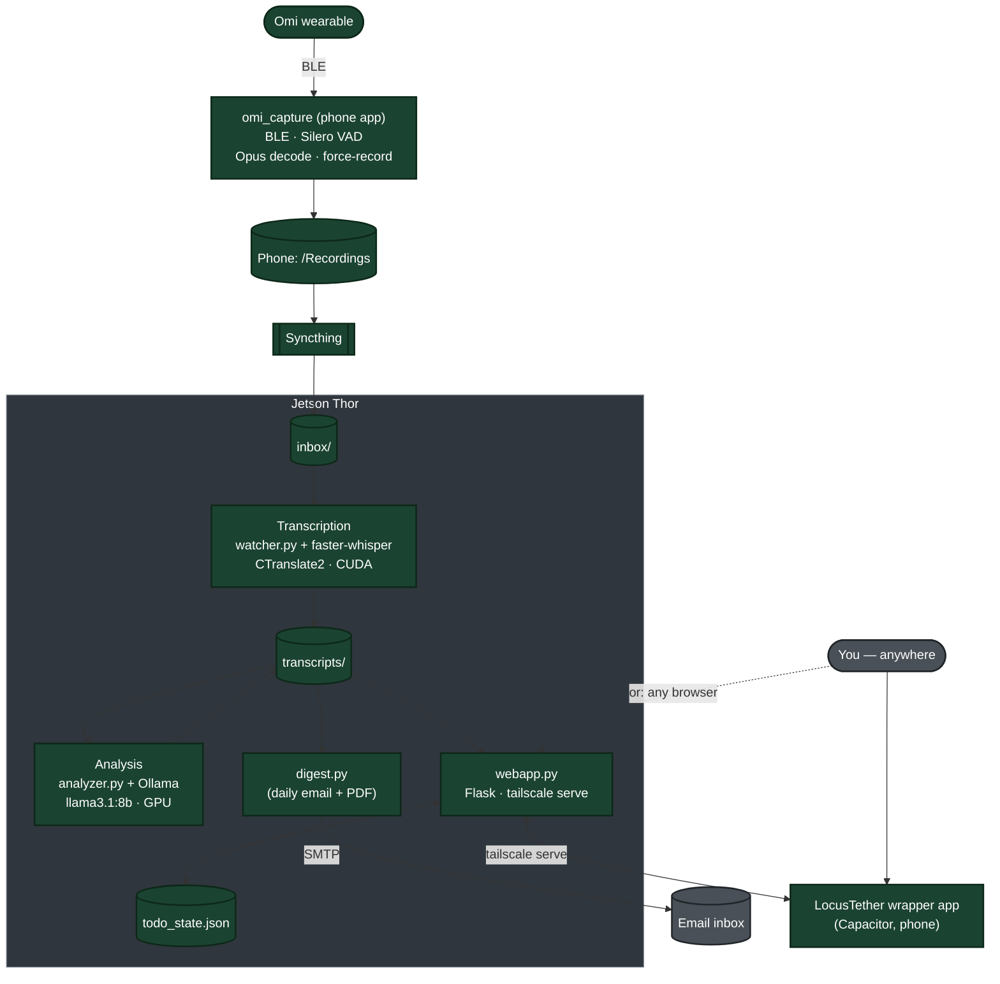

# LocusTether: A Fully Local AI Memory Pipeline for the Omi Wearable


Locus: 
- a: the place where something is situated or occurs : site, location
- b: a center of activity, attention, or concentration


Tether: 
- a: a line (as of rope or chain) by which an animal is fastened so as to restrict its range of movement
- b: a line to which someone or something is attached (as for security)


## Table of Contents

- [What this project is](#what-this-project-is)
- [What is an Omi?](#what-is-an-omi)
- [Prior art — is this actually new, and why choose it over the official app?](#prior-art--is-this-actually-new-and-why-choose-it-over-the-official-app)
- [System architecture (how it actually runs)](#system-architecture-how-it-actually-runs)
- [Known limitations — read this before you rely on it](#known-limitations--read-this-before-you-rely-on-it)
- [Hardware: what's actually been tested vs. what you'll need to figure out](#hardware-whats-actually-been-tested-vs-what-youll-need-to-figure-out)
- [Phase-by-phase: what each step is trying to accomplish](#phase-by-phase-what-each-step-is-trying-to-accomplish)
- [Directory layout on the Thor](#directory-layout-on-the-thor)
- [Prerequisites](#prerequisites)
- [Setup on the Thor](#setup-on-the-thor)
- [Setup: omi_capture (phone-side capture app)](#setup-omi_capture-phone-side-capture-app)
- [Setup: LocusTether wrapper app (daily-use client)](#setup-locustether-wrapper-app-daily-use-client)
- [Using the webapp](#using-the-webapp)
- [Key terms and technologies used here](#key-terms-and-technologies-used-here)
- [Support this project](#support-this-project)
- [What's next](#whats-next)
- [Glossary](#glossary)

> Header links above use GitLab's standard anchor format — if this
> doesn't jump correctly once mirrored to GitHub (see the GitHub migration
> plan), the anchor slugs may need a small adjustment for that platform's
> slightly different rules around punctuation.

## What this project is

**LocusTether** is a self-hosted replacement for the Omi wearable's normal
cloud pipeline — end to end, not just the processing step. Omi's official
setup streams your audio through Omi's own phone app to Omi's servers,
where a cloud LLM turns it into summaries, to-do lists, and searchable
notes. LocusTether replaces every piece of that: a custom phone app
captures audio directly from the hardware, a self-hosted pipeline
transcribes and summarizes it, and either a thin native wrapper or any
browser gives you access to the result — without any of that audio or
text ever leaving your own hardware, and without Omi's own app or backend
in the loop anywhere.

Everything that actually processes your data runs on a single NVIDIA
Jetson Thor: the speech-to-text model, the language model that summarizes
it, and the code that ties it all together. No cloud API calls, no
third-party servers, nothing billed per-request. Remote access (the web
dashboard, SSH) goes over Tailscale — a private encrypted mesh network
between your own devices, never the public internet.

**Original project:** [`gl-demo-ultimate-efranklin/thor-training`](https://gitlab.com/gl-demo-ultimate-efranklin/thor-training)
— if you've forked this for your own hardware, your own issue tracker will
have different numbers/URLs than the ones linked below; these point at the
upstream project's known issues specifically.
**Known issues** are tracked as real GitLab issues (see the Known Issues
section below) rather than just code comments, going forward.

## What is an Omi?

An Omi wearable is a small, orb-shaped AI device created by the tech startup Based Hardware. It functions as a hands-free, wearable AI companion and "second brain" designed to record, transcribe, and summarize your conversations and daily activities.

- How it is worn: The tiny device can be worn discreetly around the neck as a necklace or clipped to your clothing.
- Key features: The wearable continuously listens to your voice and surroundings. The companion app (which runs on your phone or desktop) transcribes your conversations in real-time, generates summaries, highlights action items, and acts as a chat interface that remembers what you've heard or discussed.
- AI integrations: It connects to other services to automate tasks, such as sending emails, drafting notes, translating languages, or saving information directly to Google Drive.
- Privacy and Open Source: One of Omi's main selling points is its focus on data ownership. The device and software are completely open-source, allowing you to choose whether your data stays locally on your phone, is stored on your own self-hosted server, or goes to their secure cloud.

## Prior art — is this actually new, and why choose it over the official app?

Worth being upfront about, both for intellectual honesty and so nobody
mistakes this for solving a problem that was already solved:

**The core idea (local Whisper + local LLM instead of cloud AI) isn't
novel.** Plenty of projects do that swap.

**Omi's own official backend already supports pointing at local
Whisper/Ollama** as a documented configuration option — but "self-hosted"
here is misleading if you're expecting something airgapped. Their backend
still depends on Firebase, Pinecone, Redis, and Typesense as real external
cloud services even when you're running the FastAPI server yourself.
You're relocating *where the code runs*, not eliminating the cloud
dependencies — genuinely different from LocusTether's actual zero-cloud-
service design.

**[`omibutfree`](https://github.com/kbdevs/omibutfree) is a real, complete
self-hosted Omi companion that already exists** — worth knowing about
rather than pretending it doesn't. It's genuinely comprehensive for what it
does: 100% local storage, local Whisper, no middleman servers. Concrete
differences from LocusTether, though, not just a rebrand of the same
thing:
- **iOS/Swift only** — doesn't help on Android at all
- **Processes audio on the phone itself**, not offloaded to a separate,
  more powerful host machine — a different architecture and a different
  set of hardware assumptions than LocusTether's design
- **Narrower analysis**: capture, transcribe, and summarize, without
  speaker identification, a richer structured breakdown per conversation
  (atmosphere, itemized key points, decisions reached, named participants,
  owner-attributed action items), automatic speaking-style coaching, or a
  persistent cross-conversation to-do/lists system

**What specifically makes LocusTether more capable than either of those,
concretely, not just "different":**
- **Genuinely zero cloud service dependencies** — not just relocated
  compute like Omi's own "self-hosted" mode, actually nothing phoning home
  after initial model downloads. This now extends all the way to phone-side
  capture too: `omi_capture` (see below) talks to the Omi hardware directly
  over BLE, replacing Omi's own app entirely rather than just intercepting
  what it sends.
- **Speaker diarization with real voice recognition** — not just "4
  distinct speakers," but matching a specific enrolled voice by name
  across different recordings, confirmed working on real hardware
- **Speaking-style coaching that's actually about *your* speech** in a
  multi-person recording, not blended metrics from everyone in the room —
  a real, fixed bug during development, not a design afterthought
- **A structured analysis schema built for real substance**, not just a
  one-line summary: mood/tone, itemized key points, decisions actually
  reached (distinct from facts worth remembering), named participants
  when actually stated, and owner-attributed action items for
  multi-person meetings
- **A genuinely usable webapp**, not just a data viewer: manually add
  to-dos directly (not just review AI-extracted ones), a Settings menu
  covering voice enrollment, daily digest email opt-in, and light/dark
  theme + text size, and inline editing of anything the AI got wrong
- Works from any Android phone via Syncthing to whatever host hardware you
  have — not locked to processing-on-the-phone

So: the underlying *technique* here is well-trodden ground. What doesn't
appear to already exist, as far as this research found, is the specific
combination LocusTether targets — zero cloud dependencies from the
hardware all the way through, works from any Android phone to whatever
host hardware you have, plus a genuinely fuller productivity and analysis
layer built on top.

## System architecture (how it actually runs)



🟢 **Dark green: built, tested, working end-to-end** on real hardware with
real recordings and real daily use — including getting past several
hardware-specific bugs unique to being early adopters of very new NVIDIA
silicon (see the phase-by-phase notes below), and a genuine phone-side BLE
capture app (`omi_capture`) confirmed working against the actual Omi Dev
Kit 2. Nothing in this diagram is currently blocked or unimplemented.

Two things worth calling out about this design:

- **Nothing in this diagram is triggered manually except the "You" node.**
  `omi_capture` reacts to speech (via real VAD, not a schedule), Syncthing
  reacts to filesystem events, the watcher reacts to new files instantly,
  and the digest fires on a daily timer. The webapp's refresh button is
  the *only* on-demand action anywhere in the system — it doesn't send
  anything anywhere, it just asks "what do you currently have."
- **The webapp is reachable from anywhere without exposing anything
  publicly.** `webapp.py` binds to `127.0.0.1` only; `tailscale serve` makes
  it reachable over your private Tailscale network (the same one SSH
  already uses), with real HTTPS, and zero public internet exposure. The
  wrapper app is just a convenience shell around that same URL — using it
  is optional; a plain browser pointed at the same `tailscale serve`
  address works identically.

## Known limitations — read this before you rely on it

Tracked as real GitLab issues going forward, not just a static list — this
section is a snapshot, the issue tracker is the source of truth. Organized
by how much it should actually worry you.

**Worth knowing, not usually a problem:**
- **Occasional hallucination in `key_facts`.** Confirmed pattern: the model
  can repurpose a number from one context into a fabricated different fact
  (e.g. turning "100% coverage" into "the team has 100 containers"). A
  prompt fix plus an automated filter now catch the specific pattern we've
  actually seen, but this is a small-model limitation, not something fully
  eliminated — spot-check anything that looks suspiciously specific.
- **Speaker diarization accuracy hasn't been rigorously measured.** It
  clearly works — confirmed on real multi-speaker recordings, confirmed
  matching a specific enrolled voice correctly across different recordings
  — but "does it get every hand-off exactly right" has only been checked
  by ear, not measured at scale.
- **Very quiet or whispered speech often doesn't transcribe reliably.**
  Real VAD can correctly detect that speech happened while faster-whisper
  still comes back with little or nothing intelligible — likely an
  intrinsic limitation of how Whisper-family models handle whispered
  audio, not something straightforwardly fixable. A near-empty result like
  this is now at least caught and skipped before it becomes a cluttering
  "Empty Transcript" conversation entry, but the underlying transcription
  gap itself remains.
- **Merged-conversation detection is new and unproven.** A separate check
  now flags when a single recording might actually be multiple unrelated
  conversations merged together (surfaced as a warning banner in a
  conversation's detail view), but nothing auto-splits yet, and its real
  false-positive/false-negative rate hasn't been established — treat its
  warnings skeptically until it's seen more real-world use.

**Real, unresolved gaps:**
- **Real VAD can't tell whose voice it is.** `omi_capture`'s Silero VAD
  correctly detects that speech occurred, but not whether it's actually
  *you* speaking versus ambient conversation nearby — an other-people
  conversation gets captured and processed the same as a real one. Only
  diarization after the fact can answer "whose voice," and nothing
  currently filters on it at capture time.
- **The same action item can get extracted more than once** across
  separate conversations, with no deduplication yet.
- **No automatic BLE reconnect** if the connection to the Omi drops
  mid-day — `omi_capture` needs a manual restart to resume listening.
- **Full multi-hour/full-day battery and reliability behavior is still
  genuinely untested** past short sessions.
- **Test coverage is real but partial.** `tests/` and CI (`.gitlab-ci.yml`)
  now cover several modules (analyzer, digest preferences, manual to-dos,
  speech metrics, UI preferences), but not the whole codebase — a passing
  CI run doesn't mean everything was exercised.
- **Only tested on one specific piece of hardware** — see the dedicated
  hardware section below.

## Hardware: what's actually been tested vs. what you'll need to figure out

Every piece of this pipeline has been built and debugged against **one
specific device**: an NVIDIA Jetson Thor (L4T R39.2 / JetPack 7.2, 128GB
unified memory, `sm_110` GPU architecture). That hardware was new enough,
at the time, that basic pieces (a working CUDA-accelerated CTranslate2
build) didn't exist prebuilt anywhere and needed real from-source
debugging to get working at all.

On the phone side, everything has been built and tested against **one
specific phone**: a Pixel 10 Pro XL running Android. `omi_capture` and the
LocusTether wrapper app are both Android-only — no iOS build has been
attempted for either.

**What this means for you, concretely:**
- If you're on a different Jetson model, a desktop PC with an NVIDIA GPU,
  or anything else — **none of this is guaranteed to work identically**,
  and some of it may need real, hands-on debugging specific to your setup,
  the same way this project needed three real rounds of dependency
  debugging just for diarization on Thor specifically.
- The one genuinely good news data point: PyTorch (needed for diarization
  and voice enrollment) installed via plain `pip install torch` and
  correctly detected CUDA on Thor with zero custom build — unlike
  CTranslate2, which needed a real from-source fight. Standard desktop
  NVIDIA GPUs are likely to have an even easier time than Thor did, since
  Thor's specific architecture was unusually new.
- **Diarization is deliberately optional** (`OMI_DIARIZATION_ENABLED=false`)
  specifically because it adds real GPU memory overhead (~4GB) that a
  smaller GPU might not have room for. If you're on a constrained GPU,
  start with this off, and with a smaller Whisper model, before assuming
  something's broken.
- The `docker/Dockerfile` and `pipeline/config.py` have extensive inline
  comments documenting every real hardware-specific issue hit and fixed
  along the way — read them if something breaks, since the actual failure
  and fix for a *previous* hardware-specific bug is probably already
  written down right next to the code it affects.
- On a different Android phone, `omi_capture`'s BLE scan/connect logic
  should behave the same (it's a direct GATT connection to the Omi's own
  advertised UUIDs, not phone-specific), but foreground-service behavior
  around battery optimization varies meaningfully across Android OEMs —
  Samsung and other heavily-customized Android skins are known, in
  general, to be more aggressive about killing background services than
  stock/Pixel Android is.

## Phase-by-phase: what each step is trying to accomplish

### Phase 0/1 — Getting audio off the Omi and onto the Thor
**Goal:** capture raw audio from the Omi wearable and land it in the
Thor's `inbox/` automatically, with zero manual action anywhere in the
chain. **Status: done.**

The original plan was to let Omi's own official app write recordings to
phone storage and have Syncthing pick them up from wherever that turned
out to be. Once the hardware actually arrived, that plan changed: Omi's
official app was replaced entirely with **`omi_capture`**, a purpose-built
Flutter app (full setup below) that talks directly to the Omi hardware
over BLE, decodes its Opus-encoded audio in real time, runs a real Silero
VAD model to detect actual speech (not just volume), and writes segmented
WAV files straight to phone storage — no cloud round-trip, and no
dependency on Omi's own app or backend at any point.

Real findings from getting this working on actual hardware:
- The Omi Dev Kit 2's firmware reports codec byte `21` for Opus, not `20`
  as the reference fork (`my-omi`, below) assumed — confirmed directly
  against this specific device.
- BLE/Opus/UUID logic was ported from
  [`unforced/my-omi`](https://github.com/unforced/my-omi), a small (and by
  now fairly stale — no real commits since ~December 2024) minimal Omi
  fork, cloned locally purely as reference material, not a live
  dependency. Everything else — the foreground service, VAD integration,
  force-record mode — was built fresh for `omi_capture`.
- A crude RMS/volume threshold was tried first for speech detection and
  abandoned after real testing showed it couldn't distinguish a muffled,
  quiet voice from an unrelated voice across the room — both landed in the
  same energy range. Replaced with real Silero VAD, which judges the
  acoustic shape of speech rather than just loudness. (Note this only
  solves speech-vs-silence — telling *whose* voice it is is a separate,
  still-open problem; see Known Limitations.)
- Flutter's foreground-service isolate doesn't share initialization state
  with the main UI isolate — both Opus and the VAD model needed their own
  explicit re-initialization *inside* the service's own isolate, or they
  silently failed with no error reaching the main log stream at all.
- A **force-record mode** (fixed-duration recording that bypasses VAD
  entirely) was added for situations like attending a presentation without
  speaking — files save with a `-forced` filename suffix so a future
  ambient-speaker filter can treat them differently.

Getting the resulting recordings from the phone onto the Thor is
unchanged from the original plan: Syncthing, one-directional
Send-Only/Receive-Only pairing, just watching `omi_capture`'s own output
folder instead of wherever Omi's own app used to write. Verified working,
zero manual action, event-driven rather than scheduled.

**iOS: not attempted.** Both `omi_capture` and the wrapper app are
Android-only; a genuine iOS build would need its own separate native or
Flutter effort.

### Phase 2 — Notice new audio and hand it off for processing
**Goal:** a background process that's always watching, robust to
in-progress file transfers, survives crashes/reboots. **Status: done.**
`watcher.py`, running as a systemd-managed Docker container.

### Phase 3 — Turn audio into text (and now, who said it)
**Goal:** accurate, fast, GPU-accelerated, entirely local transcription —
and, as of a later addition, knowing which of several distinct speakers
said each part of it.

**Status: done**, including a second real hardware saga on top of the
original one:

The original transcription build was the hardest engineering lift in this
project, since Thor's GPU architecture was new enough that no prebuilt
software anywhere supported it. Required: finding the correct CUDA repo for
this hardware (NVIDIA's generic public repo doesn't carry it), patching
around a CMake architecture-lookup table that predates this GPU's
existence, and clearing a Python packaging policy (PEP 668). All documented
inline in `docker/Dockerfile`.

**Speaker diarization** (`pipeline/diarize.py`, WhisperX + pyannote.audio,
layered on top of the existing transcription rather than replacing it) hit
its own, different hardware saga — genuinely useful to document
separately, since it's a different failure mode than the CTranslate2 one
above:
- Unlike CTranslate2 (deliberately built from source specifically to avoid
  a PyTorch dependency), diarization's alignment/speaker-ID models are
  PyTorch-native. Good news confirmed directly: PyTorch's official wheels
  install cleanly via a bare `pip install torch` on this hardware and
  correctly detect CUDA — no from-source build needed here, unlike
  CTranslate2.
- The real trap: installing `whisperx`/`pyannote.audio` afterward silently
  downgrades torch to an older pinned version as a transitive dependency —
  and that older version has no CUDA wheel for this architecture, so pip
  silently falls back to CPU-only with no error. Fix: force-reinstall the
  correct torch version with `--no-deps` after.
- That fix alone isn't enough either — it leaves `torchaudio`/`torchvision`
  behind at the old (now-mismatched) version, since they're tightly
  version-locked to torch's exact build. Real fix: reinstall all three
  together in one command so pip resolves a mutually compatible set.
- A `condition_on_previous_text=False` change (an attempted mitigation for
  a separate Whisper repetition-hallucination issue) turned out to trade
  that rare failure mode for a worse, systematic one — capitalization/
  punctuation degrading partway through longer recordings. Reverted to
  Whisper's default after direct before/after comparison confirmed it.

All three dependency issues, and the revert, are documented inline in
`docker/Dockerfile` and `pipeline/config.py` at the point they were fixed.

### Phase 4 — Turn the transcript into something useful
**Goal:** title, summary, category, action items (including appointments
and reminders, with due dates parsed where mentioned), and key facts —
matching the value Omi's cloud AI would produce, and since extended further
(atmosphere/tone, named participants when actually stated, richer
itemized key points, and decisions reached as their own distinct field) to
handle genuinely substantive discussions and meetings, not just quick
personal voice memos. **Status: done.** `analyzer.py` + Ollama, using
JSON-mode output for reliably structured results. Getting Ollama onto the
GPU on this hardware needed a manual systemd override; MPS had to be
disabled entirely after it was found to break Ollama's GPU discovery.

Once diarization (Phase 3) started feeding real speaker information into
this step, real-hardware testing surfaced a genuinely useful lesson: the
model handles a short contextual note ("this conversation had 4 distinct
speakers") much better than being fed the whole transcript reformatted
into per-speaker dialogue lines — the latter measurably degraded both
content extraction and caused the model to fabricate placeholder
"participants" entries, despite explicit instructions not to. Several
fields (`participants`, `decisions_made`) also needed their "return an
empty list when nothing applies" rule enforced in code rather than relying
on prompt wording alone, after the model persistently padded them with
placeholder entries regardless of instructions.

Two further refinements came out of real daily use once the pipeline had
real family conversations running through it regularly: a check that
skips analysis entirely for near-empty/trivial transcripts (previously, a
whispered conversation VAD picked up but Whisper couldn't meaningfully
transcribe would still get fully analyzed and shown as a real "Empty
Transcript" conversation), and a separate, best-effort detection pass that
flags when a single recording might actually be multiple genuinely
unrelated conversations merged together — surfaced as a warning in the
webapp, not yet auto-split (see Known Limitations for both).

### Phase 5 — Surface it without having to go looking
**Goal:** a daily digest that's actually pleasant to read, not just a data
dump. **Status: done**, and grew well beyond the original scope:
- HTML email with visual checkboxes and color-coded categories (plain-text
  fallback included for non-HTML clients)
- A genuinely clickable table of contents **in the attached PDF**
  (WeasyPrint) — the email body's own jump-links are included as a bonus
  but not relied on, since in-email anchor navigation is
  well-documented as unreliable across clients (Gmail included)
- Optional SMTP email delivery, credentials kept in a git-ignored
  `.env.digest` file, never committed
- A "Speaking Style Feedback" section (see Phase 6) when coaching was run
  that day — grouped by the conversation's own date, not whenever the
  coaching script happened to be run

### Phase 6 — Speaking style coaching
**Goal:** pace, filler-word, and hedging-language feedback to help
articulate more clearly — the kind of coaching a human speech coach might
give, grounded in real transcript data. **Status: done.** Deliberately
on-demand (`speech_coach.py`), not run automatically on every recording,
since reviewing speaking style makes sense for a deliberate practice
recording, not a casual to-do-list voice memo. Combines:
- **Free, deterministic metrics** (`speech_metrics.py`): words-per-minute,
  pause locations/durations, and filler-word frequency — all computed from
  data Whisper already produces, no new dependencies or audio
  re-processing
- **LLM-based qualitative feedback**, grounded in those numbers — specific
  strengths, areas to improve (each with an actual transcript quote and a
  concrete alternative phrasing), pace commentary, and an overall take

### Phase 7 — On-demand web dashboard
**Goal:** view today's data from anywhere — not just at home, not waiting
for the end-of-day email — with a simple refresh button, plus something
email fundamentally can't do: **real, functioning checkboxes** that
actually persist. **Status: done.** `webapp.py` (Flask) + `todo_state.py`
(a small persisted overlay tracking which to-dos are checked off, kept
separate from the read-only LLM output) + `tailscale serve` for remote
access without any public exposure, either directly or via the LocusTether
wrapper app. Deliberately lightweight — this only reads existing JSON
files off disk, no GPU/LLM work, negligible resource cost at rest, safe to
run continuously alongside robotics work on the same device.

## Directory layout on the Thor

```
/home/<you>/
├── projects/
│   └── thor-training/                <- CODE (this repo)
│       ├── pipeline/                  <- core: transcription + analysis (self-contained)
│       │   ├── config.py
│       │   ├── watcher.py
│       │   ├── transcribe.py
│       │   ├── analyzer.py
│       │   ├── prompts.py
│       │   ├── data_store.py         <- shared data-loading, used by webapp/digest/speech_coach too
│       │   └── integrations.py       <- date parsing (due_date resolution)
│       ├── webapp/                    <- Phase 7: on-demand dashboard
│       │   ├── webapp.py
│       │   └── todo_state.py         <- persisted checkbox state
│       ├── digest/                    <- Phase 5: daily email/PDF digest
│       │   └── digest.py
│       ├── speech_coach/              <- Phase 6: on-demand speaking-style coaching
│       │   ├── speech_metrics.py     <- free deterministic metrics
│       │   └── speech_coach.py
│       ├── mobile-app/                <- LocusTether wrapper app (Capacitor, Node) - daily-use client
│       ├── omi_capture/               <- phone-side BLE/VAD capture app (Flutter, Dart) - replaces Omi's own app
│       ├── tests/                     <- automated tests (pytest), run via .gitlab-ci.yml
│       ├── systemd/                   <- all .service / .timer unit files
│       │   ├── omi-watcher.service
│       │   ├── webapp.service
│       │   ├── digest.service
│       │   └── digest.timer
│       ├── docker/
│       │   ├── Dockerfile
│       │   ├── docker-compose.yml
│       │   ├── entrypoint.sh
│       │   ├── requirements-docker.txt
│       │   └── .env.example
│       ├── analysis/
│       │   └── analyze.py            <- manual CLI for testing prompt changes
│       ├── requirements.txt           <- host-side (webapp/digest) deps
│       ├── LICENSE
│       ├── DEVELOPMENT_HISTORY.md     <- the real story behind every fight documented in this README
│       ├── .dockerignore / .gitignore
│       ├── .gitlab-ci.yml             <- CI: runs tests/ automatically
│       ├── .env                       <- created locally, not tracked
│       ├── .env.digest.example        <- tracked template, no real secrets
│       └── .env.digest                <- created locally, not tracked (SMTP creds)
│
└── omi-data/                          <- DATA (not part of this repo, not in git)
    ├── inbox/                         <- Syncthing drops files here (Phase 1)
    ├── processing/
    ├── archive/
    ├── transcripts/                   <- *.json, *.analysis.json, *.speech_coach.json
    ├── failed/
    ├── digests/                       <- daily .md digests
    ├── todo_state.json                <- Phase 7 checkbox state
    └── pipeline.log
```

`pipeline/` is deliberately self-contained (no imports outside itself) — the
other three (`webapp/`, `digest/`, `speech_coach/`) each add `pipeline/` to
their own `sys.path` at runtime rather than needing Python package/import
gymnastics. This is a one-directional dependency: `pipeline/` never imports
from any of the others.

`mobile-app/` and `omi_capture/` are genuinely separate applications —
different languages and toolchains entirely (Node/Capacitor and
Dart/Flutter, respectively) — bundled into this same repo for
single-source-of-truth convenience. Neither is imported by, or a runtime
dependency of, anything in `pipeline/`, `webapp/`, `digest/`, or
`speech_coach/`; they're client-side apps that talk to the webapp over
HTTP, nothing more.

## Prerequisites

**Get the code:**
```bash
mkdir -p ~/projects && cd ~/projects
git clone <this-repo-url> thor-training
cd thor-training
```

**Docker + NVIDIA Container Runtime** — should already be present on a
stock JetPack image, but worth confirming before anything else, since a
missing/misconfigured runtime here causes confusing failures much later:
```bash
docker --version
cat /etc/docker/daemon.json   # should show "default-runtime": "nvidia"
nvidia-smi -L                 # should list your GPU
```
If `default-runtime` isn't set to `nvidia`, the transcription/analysis
container will build fine but fail to actually see the GPU at runtime.

**Tailscale** (needed for the web dashboard and for reaching this device
remotely at all):
```bash
curl -fsSL https://tailscale.com/install.sh | sh
sudo tailscale up
```
That last command prints a URL — since a headless Thor has no browser,
open that URL on your phone or laptop to authenticate this device into
your Tailscale account.

Phone-side prerequisites (Flutter, Node/npm, an Android phone with USB
debugging enabled) are covered in their own setup sections below, since
they're only needed if you're building `omi_capture` or the wrapper app
yourself rather than just running the Thor-side pipeline.

## Setup on the Thor

```bash
mkdir -p ~/omi-data/{inbox,processing,archive,transcripts,failed,digests}
cd ~/projects/thor-training
cp docker/.env.example .env
# edit .env: OMI_DATA_DIR=/home/<you>/omi-data
```

**Ollama** (native, not containerized):
```bash
curl -fsSL https://ollama.com/install.sh | sh
ollama pull llama3.1:8b
```
Check whether it's actually using the GPU:
```bash
ollama run llama3.1:8b "test" --verbose
ollama ps   # look at the PROCESSOR column — should say "100% GPU", not "100% CPU"
```
If it shows CPU, this hardware's install script didn't recognize the JetPack
version and silently skipped GPU setup — even though the GPU-capable backend
is already present on disk. Confirm the backend actually exists:
```bash
ls /usr/local/lib/ollama/cuda*/   # look for a cuda_v13 (or similar) directory
```
If it's there, force Ollama to use it via a systemd override:
```bash
sudo systemctl edit ollama
```
Add these lines in the editor that opens (adjust the `cuda_v13` path to
match whatever the `ls` above actually showed):
```ini
[Service]
Environment="OLLAMA_IGPU_ENABLE=1"
Environment="GGML_BACKEND_PATH=/usr/local/lib/ollama/cuda_v13/libggml-cuda.so"
Environment="LD_LIBRARY_PATH=/usr/local/lib/ollama:/usr/local/lib/ollama/cuda_v13"
```
Then:
```bash
sudo systemctl daemon-reload
sudo systemctl restart ollama
```
and re-run the `ollama ps` check above to confirm it now shows GPU.

**The transcription/analysis pipeline** (Docker):
```bash
docker compose --env-file .env -f docker/docker-compose.yml up -d --build
```
`--env-file .env` matters here and isn't optional cosmetics: Compose looks
for `.env` relative to the *compose file's own directory* by default, not
wherever you run the command from — since `.env` lives at repo root while
the compose file is in `docker/`, omitting this flag means `OMI_DATA_DIR`
silently resolves to blank, and the container ends up bind-mounted to
filesystem root (`/inbox`, `/transcripts`, etc.) instead of your real data
directory. It'll still start and report "Up" with no obvious error — the
only visible sign is a `WARN... variable is not set` line easy to miss or
assume is harmless. To deploy a code change to anything in `pipeline/`
later, use the full down/up cycle, not a bare restart:
```bash
docker compose --env-file .env -f docker/docker-compose.yml down
docker compose --env-file .env -f docker/docker-compose.yml up -d --build
```
`docker compose restart` does **not** rebuild the image, so it won't pick
up a code change — it'll just restart the container running the old code.

**Host-side dependencies** (webapp + digest, not containerized):
```bash
pip3 install -r requirements.txt --break-system-packages
```

**Digest email (optional)**:
```bash
cp .env.digest.example .env.digest
chmod 600 .env.digest   # holds a real SMTP credential
# fill in real values, then:
sudo cp systemd/digest.service systemd/digest.timer /etc/systemd/system/
sudo sed -i "s/<your-username>/$(whoami)/g" /etc/systemd/system/digest.service /etc/systemd/system/digest.timer
sudo systemctl daemon-reload
sudo systemctl enable --now digest.timer
```

**Speaking style coaching (on-demand)**:
```bash
cd speech_coach
python3 speech_coach.py ~/omi-data/transcripts/<stem>.json
```

**On-demand web dashboard**:
```bash
sudo cp systemd/webapp.service /etc/systemd/system/
sudo sed -i "s/<your-username>/$(whoami)/g" /etc/systemd/system/webapp.service
sudo systemctl daemon-reload
sudo systemctl enable --now webapp
sudo tailscale serve --bg https / http://127.0.0.1:5001
```
The webapp runs as this separate, host-level systemd service — **not**
inside Docker, unlike the transcription/analysis pipeline above. A code
change to anything in `webapp/` needs `sudo systemctl restart webapp`
specifically; rebuilding the Docker container does nothing for it, and
vice versa. These are two entirely independent deploy steps.

**Persistent watcher (bare-metal alternative to Docker)**:
```bash
sudo cp systemd/omi-watcher.service /etc/systemd/system/
sudo sed -i "s/<your-username>/$(whoami)/g" /etc/systemd/system/omi-watcher.service
sudo systemctl daemon-reload
sudo systemctl enable --now omi-watcher
```

All three `systemd/*.service` files use an explicit `<your-username>`
placeholder rather than systemd's `%h` specifier — worth knowing why, since
`%h` looks like the obvious fix and doesn't work: in system-level units
(these), `%h` resolves to the *service manager's* home directory (root,
i.e. `/root`), not the `User=` account's home, regardless of what `User=`
is set to. That's documented systemd behavior, not a bug — `%h` only
reliably reflects a unit's own `User=` inside `systemctl --user` (per-user
manager) instances, not system-wide ones. Find-and-replace
`<your-username>` with your actual username in each file before installing
it — every path in these files needs that one substitution.

## Setup: omi_capture (phone-side capture app)

Replaces Omi's own official app entirely — this is what actually talks to
the Omi hardware over BLE and gets audio onto your phone in the first
place. Android only; confirmed working on a Pixel 10 Pro XL. Lives in
`omi_capture/` in this repo.

**Install Flutter**, if you don't already have it — see
[docs.flutter.dev/get-started/install](https://docs.flutter.dev/get-started/install)
for your OS, then confirm the toolchain:
```bash
flutter doctor   # confirm the Android toolchain is detected
```

**Build and install onto a connected phone:**
```bash
cd ~/projects/thor-training/omi_capture
flutter pub get
flutter devices    # confirm your phone is detected over USB
                    # (enable Developer Options -> USB debugging first)
flutter run         # builds and installs directly onto the connected phone
```

**Permissions the app requests on first launch** — grant all of these,
capture won't work correctly without them:
- **Bluetooth** (scan + connect) — talking to the Omi hardware itself
- **Notifications** — required just to show the foreground service's
  persistent "listening" notification (Android 13+)
- **Storage** (manage/read/write external storage) — writing segmented
  recordings to the phone
- **Battery optimization exemption** — without this, Android can still
  kill the background service over time even with the notification
  showing

**Pairing with your Omi device:** power on the Omi, open the app — it
scans for up to 15 seconds looking for a BLE advertisement matching the
Omi's known service UUID, connects automatically once found, reads the
audio-codec characteristic to confirm Opus, and starts listening. There's
no separate manual pairing step in Android's own Bluetooth settings — this
is a direct BLE GATT connection, not classic Bluetooth pairing.

**Force-record mode:** tap "Force Record..." while listening to start a
fixed-duration recording that ignores VAD/silence-gap entirely — useful
for something like a presentation you're attending but not speaking in.
Files save with a `-forced` filename suffix.

**Where recordings land:** `/storage/emulated/0/Recordings` on the phone.
This is the folder Syncthing needs to be pointed at (Send-Only on the
phone, Receive-Only on the Thor) so recordings reach the Thor's `inbox/`
automatically — just point Syncthing's phone-side send folder here instead
of wherever Omi's own app used to write.

**Known limitation:** no automatic BLE reconnect if the connection drops
mid-day — currently needs a manual restart of the app. See Known
Limitations above.

## Setup: LocusTether wrapper app (daily-use client)

A thin Capacitor shell that just displays the self-hosted webapp inside a
WebView — this is what you'd actually open day to day, rather than typing
a Tailscale URL into a browser every time. Its own native logic is
genuinely minimal: enter a server URL once, and it loads that URL
full-screen from then on. Android only. Lives in `mobile-app/` in this
repo.

**Install Node.js**, if you don't already have it, then install
dependencies:
```bash
cd ~/projects/thor-training/mobile-app
npm install
```

**Build and install onto a connected phone:**
```bash
npx cap sync android
npx cap open android    # opens Android Studio — build/run from there
                          # onto a connected device
```

**On first launch**, you'll be prompted for a server URL — enter your
Thor's `tailscale serve` address (the same one you'd otherwise type into a
browser, e.g. `https://your-device.your-tailnet.ts.net`). It's saved via
Capacitor's Preferences plugin, so you only enter it once. A small link
icon (top-right, deliberately positioned away from the webapp's own bottom
tab bar and its own separate Settings gear, to avoid the two colliding)
lets you change or reconnect to a different server later.

**Note for anyone customizing this further:** `env(safe-area-inset-*)`
doesn't reliably propagate into the nested iframe/WebView the webapp
renders in — the inset is applied at this wrapper's own outer, top-level
document instead, not inside the webapp's own CSS. Worth knowing before
"fixing" what looks like a webapp-side layout bug that's actually a
wrapper-side one.

## Using the webapp

Once running (`tailscale serve` gives you a URL reachable from any device
on your tailnet, or open the wrapper app if you've installed it), five tabs
across the bottom:

- **Today** — a daily at-a-glance view: a stats summary (conversations,
  people, to-dos, and a speaking-pace trend if coaching's run), today's
  open to-dos, today's conversations, and anything else logged today.
- **Conversations** — every conversation, most recent first, with full
  detail on tap: overview, mood/tone, key points, decisions made, named
  participants, action items, and speaking-style feedback if it ran. Edit
  and Delete buttons on each — correct anything the AI got wrong directly,
  or archive a conversation out of your active views (the underlying
  recording and transcript stay fully intact on disk either way, this
  only affects what shows in the app). A warning banner appears here if
  the recording might actually be multiple unrelated conversations merged
  together — see Known Limitations.
- **To-Dos** — every open action item across all history, whether
  extracted from a conversation or added manually right here. A "Today
  only" filter toggle, and an input at the top to add a to-do directly —
  this doesn't require a conversation at all.
- **Feedback** — speaking-style coaching reports, when they've run.
- **Lists** — things you mentioned wanting to check out (movies,
  restaurants, books, etc.), grouped by whatever you called the list.

### Settings

Reachable via the gear icon (top-right of Today/most tabs):

- **Voice Recognition** — enroll a voice by name (upload a short, clean
  10-30 second sample of just that person talking). Mark yourself as the
  **main user**, and speaking-style coaching will analyze only your own
  speech in a multi-person recording, not blended metrics from whoever
  else is in the room. Enrolled voices get recognized by name in future
  conversations instead of showing as an anonymous speaker label.
- **Daily Digest Email** — opt in with an email address to get a daily
  summary emailed to you (needs SMTP credentials configured separately,
  see `.env.digest.example`) — or leave it off; the pipeline works exactly
  the same either way.
- **Appearance** — Dark/Light theme, and Small/Medium/Large text size.
  Both persist server-side, so they follow you across devices rather than
  being tied to one browser's local storage.

## Key terms and technologies used here

**Omi** — the open-source AI wearable this project is built around (MIT
licensed). Normally pairs with a phone app that streams audio to Omi's
cloud for processing; here, `omi_capture` replaces that phone app entirely.

**BLE (Bluetooth Low Energy) / GATT** — the wireless protocol the Omi
hardware uses to stream audio. GATT (Generic Attribute Profile) is the
data model BLE devices expose — "services" and "characteristics" —
that `omi_capture` reads directly, rather than going through classic
Bluetooth pairing.

**Opus** — the audio codec the Omi hardware encodes its microphone data as
before sending it over BLE. `omi_capture` decodes this in real time via
`opus_dart`/`opus_flutter`.

**Silero VAD (Voice Activity Detection)** — the real speech-detection
model `omi_capture` runs on decoded audio, replacing an earlier crude
volume-threshold approach that couldn't distinguish a quiet voice from an
unrelated one further away.

**Flutter / Dart isolate** — Dart's unit of concurrent execution; unlike
threads, isolates don't share memory or initialization state by default.
`omi_capture`'s foreground service runs in its own isolate, separate from
the main UI — a real bug hit during development, since initializing Opus
or the VAD model only in the main UI isolate silently never reached the
background service at all.

**Force-record** — `omi_capture`'s fixed-duration recording mode that
bypasses VAD/silence-gap entirely, for situations like attending a
presentation without speaking. Saved files carry a `-forced` filename
suffix.

**`my-omi`** — a small, largely inactive open-source Omi fork
([`unforced/my-omi`](https://github.com/unforced/my-omi)) cloned locally as
reference material for `omi_capture`'s BLE/Opus/UUID handling. Not a live
dependency, and not itself actively maintained upstream — its own last
real commit predates this project.

**Capacitor** — a framework for wrapping a web app in a native mobile
shell. The LocusTether wrapper app is a thin Capacitor shell around the
self-hosted webapp; it adds essentially no native code of its own beyond
server-URL settings.

**Syncthing** — an open-source file-synchronization tool that syncs folders
directly between devices on the same network, with no cloud server in the
middle. Event-driven (reacts to file changes instantly), not scheduled.

**Jetson Thor** — the physical NVIDIA computer everything in this project's
pipeline and webapp runs on. A compact "edge AI" device: a real GPU and
128GB of unified memory, built for running AI workloads locally instead of
in a data center.

**CUDA** — NVIDIA's platform for running general-purpose computation on the
GPU rather than the CPU. Both transcription and analysis depend on it for
speed; without it, everything here would still work, just 10-20x slower.

**cuDNN** — NVIDIA's library of GPU-accelerated neural network building
blocks, built on top of CUDA.

**CTranslate2** — a high-performance inference engine for Transformer
models. Compiled from source specifically for Thor's brand-new GPU
architecture, since no prebuilt version existed anywhere at build time.

**faster-whisper** — a CTranslate2-based wrapper around OpenAI's Whisper
speech-to-text model. "Faster" because CTranslate2's engine is
significantly quicker than the original reference implementation.

**Whisper** — OpenAI's speech-to-text model. Converts recorded voice into
text.

**Docker / container** — packaging software with its exact dependencies so
it runs consistently regardless of what else is on the machine. Keeps this
pipeline's Python/CUDA environment from ever colliding with separate
robotics projects on the same Thor.

**NVIDIA Container Runtime** — the plumbing that lets a Docker container
see and use the GPU. Required `NVIDIA_VISIBLE_DEVICES` and
`NVIDIA_DRIVER_CAPABILITIES` set explicitly on this hardware — undocumented
at the time, found through direct testing.

**MPS (Multi-Process Service)** — NVIDIA's tool for sharing one GPU across
multiple processes with a soft cap. Tried here to leave headroom for
robotics work, then **deliberately disabled** after confirming it causes
Ollama's model runner to hang indefinitely on this hardware — a real driver
bug, not a config mistake. The pipeline now relies on default CUDA
time-slicing instead, which is fine given how brief/bursty its actual GPU
usage is.

**Ollama** — runs large language models locally, serving them over a local
API. Needed a manual systemd override on this hardware to force GPU use —
its install script didn't recognize this JetPack version and silently fell
back to CPU otherwise.

**LLM (Large Language Model)** — the model producing structured summaries
and coaching feedback. Currently `llama3.1:8b`.

**Flask** — a lightweight Python web framework, used for the on-demand
dashboard (`webapp.py`). Chosen for minimal resource footprint — this
project's "don't overburden the Thor" constraint, since it needs to coexist
with separate, more GPU-intensive robotics work.

**Tailscale** — a private mesh network (built on WireGuard) between your
own authenticated devices. Used for both SSH and the web dashboard —
reachable from anywhere with internet, never exposed to the public internet
at all. `tailscale serve` specifically exposes a `localhost`-only web
service to your tailnet with real HTTPS, without changing how that service
binds at all.

**WeasyPrint** — generates the digest's PDF attachment. Chosen over the
more commonly-used `wkhtmltopdf` after directly testing both: wkhtmltopdf
converted the digest's table-of-contents links into broken external file
references, while WeasyPrint produced genuine, verified-working internal
PDF navigation.

**watchdog** — the Python library detecting new files in a folder
instantly, without polling on a timer.

**systemd** — Linux's service manager. Keeps Ollama, the watcher, the
digest timer, and the webapp running persistently, restarting them
automatically on crash or reboot.

## Support this project

If this saved you the hardware-specific debugging effort documented
throughout this README — the CTranslate2 build fight, the diarization
dependency saga, all of it — and you'd like to say thanks:

<!-- TODO: actual GitHub Sponsors / Ko-fi / Buy Me a Coffee link goes here
     once this repo has moved to GitHub (see the GitHub migration plan) —
     a native "Sponsor" button via .github/FUNDING.yml is the planned
     approach, ties directly to this section. -->

No pressure either way — this is free, always will be, and contributions
of a working bug report or a pull request are just as welcome as a
donation.

## What's next

The real remaining work is tracked in the GitLab issue tracker — #68 is
the living priorities document, always more current than this section.
As of this writing, the biggest open items:

- **Real VAD can't identify whose voice it is** — ambient/other-people
  conversations get captured and processed the same as real ones, since
  only diarization after the fact can answer "whose voice," not VAD at
  capture time.
- **Merged-conversation detection flags a possible split, but nothing
  auto-splits yet** — the next phase of that work needs each split part
  to carry its own accurate timing and be independently reprocessable,
  which the current one-file-per-conversation data model doesn't yet
  support.
- **Duplicate action items** can appear across separate conversations
  with no deduplication.

Everything else is smaller and more incremental — see the issue tracker
for the full current picture.

## Glossary

Quick reference for jargon used throughout this README — see "Key terms
and technologies" above for the fuller *why* behind the major ones.

- **Action item** — a to-do extracted from a conversation's content, or
  added manually in the webapp.
- **Analysis** — the structured LLM output for one conversation: title,
  overview, category, key points, decisions, action items, etc.
- **BLE / GATT** — the Bluetooth protocol and data model `omi_capture`
  uses to talk to the Omi hardware directly. See Key terms above.
- **Container** — see Docker, above.
- **Diarization** — figuring out *who* said *what* in a multi-speaker
  recording — splitting a transcript into per-speaker segments.
- **Digest** — the daily email/PDF summary of a day's conversations and
  to-dos.
- **Embedding** — a numeric fingerprint of a voice, used to recognize the
  same speaker across different recordings (see Voice enrollment, below).
- **Force-record** — `omi_capture`'s mode for recording a fixed duration
  regardless of detected speech. See Key terms above.
- **Hallucination** — an LLM generating something plausible-sounding but
  factually wrong or unsupported by the actual source material.
- **Inbox** — the folder Syncthing drops new recordings into, watched by
  `watcher.py`.
- **Isolate** — Dart's unit of concurrent execution, roughly analogous to
  a thread but without shared memory. See Key terms above.
- **Main user** — the enrolled voice marked as "this is me" — speaking-
  style coaching analyzes only their speech in a recording, not everyone
  else's.
- **Opus** — the audio codec the Omi hardware streams over BLE. See Key
  terms above.
- **Pipeline** — the whole chain of processing a recording goes through:
  transcription, diarization, analysis, coaching.
- **Prompt** — the instructions given to the LLM describing what to
  extract and how.
- **Segment** — one continuous stretch of speech in a transcript, with a
  start time, end time, and (if diarization ran) a speaker label.
- **Stem** — the filename without its extension, used as the shared ID
  linking a recording's transcript, analysis, and coaching files together
  (e.g. `meeting.m4a`, `meeting.json`, `meeting.analysis.json` all share
  the stem `meeting`).
- **VAD (Voice Activity Detection)** — automatically identifying which
  parts of an audio file actually contain speech. Used both on the Thor
  side (via Whisper's own VAD filter) and, more importantly, on the phone
  itself by `omi_capture`'s real-time Silero VAD model — which detects
  that speech occurred, but not whose voice it is (see Known Limitations).
- **Voice enrollment** — recording a short sample of someone's voice so
  future conversations can recognize them by name instead of an anonymous
  speaker label.
- **WPM (Words Per Minute)** — the speaking-pace metric used in speaking-
  style coaching feedback.
