# Omi → Jetson Thor: A Fully Local AI Memory Pipeline

## What this project is

This is a self-hosted replacement for the Omi wearable's normal cloud
pipeline. Omi's official app streams your audio to Omi's servers, where a
cloud LLM turns it into summaries, to-do lists, and searchable notes. This
project gets the same *value* — automatic transcription and structured
summaries of conversations and voice memos — without any of that audio or
text ever leaving your own hardware.

Everything runs on a single NVIDIA Jetson Thor: the speech-to-text model,
the language model that summarizes it, and the code that ties it together.
No cloud API calls, no third-party servers, nothing billed per-request.

## Architecture at a glance

```mermaid
flowchart TD
    subgraph P0["Phase 0 — Capture Discovery"]
        A1[Omi wearable records audio over Bluetooth]
        A2[Phone app saves the audio file locally]
        A1 --> A2
    end

    subgraph P1["Phase 1 — Local Sync"]
        B1["Syncthing on phone (Send Only)"]
        B2["Syncthing on Thor (Receive Only)"]
        B1 -->|"Home Wi-Fi only — no cloud relay"| B2
    end

    subgraph P2["Phase 2 — Folder Watcher"]
        C1["watcher.py notices new file in inbox/"]
        C2["Waits for the file to stop changing"]
        C3["Moves it into processing/"]
        C1 --> C2 --> C3
    end

    subgraph P3["Phase 3 — Transcription"]
        D1["faster-whisper (CTranslate2)"]
        D2["GPU-accelerated via CUDA"]
        D3["Writes transcript: .json + .txt"]
        D1 --> D2 --> D3
    end

    subgraph P4["Phase 4 — AI Analysis"]
        E1["analyzer.py sends transcript to Ollama"]
        E2["Local LLM (llama3.1:8b) generates structured JSON"]
        E3["title, overview, category, action_items, key_facts"]
        E1 --> E2 --> E3
    end

    subgraph P5["Phase 5 — Reporting"]
        F1["Daily digest job"]
        F2["Email summary or note export"]
        F1 --> F2
    end

    A2 --> B1
    B2 --> C1
    C3 --> D1
    D3 --> E1
    E3 --> F1

    classDef doneNode fill:#1b4332,stroke:#0d2818,color:#ffffff,stroke-width:2px
    classDef blockedNode fill:#1d3557,stroke:#0d1b2a,color:#ffffff,stroke-width:2px
    classDef todoNode fill:#495057,stroke:#212529,color:#ffffff,stroke-width:2px

    class A1,A2,B1,B2 blockedNode
    class C1,C2,C3,D1,D2,D3,E1,E2,E3 doneNode
    class F1,F2 todoNode

    style P0 fill:#a8dadc,stroke:#1d3557,color:#0d1b2a,stroke-width:3px
    style P1 fill:#a8dadc,stroke:#1d3557,color:#0d1b2a,stroke-width:3px
    style P2 fill:#95d5b2,stroke:#1b4332,color:#0d2818,stroke-width:3px
    style P3 fill:#95d5b2,stroke:#1b4332,color:#0d2818,stroke-width:3px
    style P4 fill:#95d5b2,stroke:#1b4332,color:#0d2818,stroke-width:3px
    style P5 fill:#ced4da,stroke:#495057,color:#212529,stroke-width:3px
```



🟢 **Green (Phases 2-4): built, tested, working end-to-end** on real hardware
with real recordings — including getting past several hardware-specific bugs
unique to being early adopters of very new NVIDIA silicon (see each phase's
notes below).

🔵 **Blue (Phases 0-1): designed and documented, blocked on hardware** — the
Omi wearable hasn't shipped yet, so these steps haven't been executed for
real, only planned. Everything downstream of them has been validated using
manually-recorded test audio dropped straight into the inbox folder, standing
in for what Syncthing will eventually deliver automatically.

⚫ **Gray (Phase 5): not started yet.**

## Key terms and technologies used here

**Omi** — the open-source AI wearable this project is built around. Normally
pairs with a phone app that streams audio to Omi's cloud for processing;
here we intercept before that cloud step.

**Syncthing** — an open-source file-synchronization tool that syncs folders
directly between devices on the same network, with no cloud server in the
middle. Used here to move audio files from the phone to the Thor
automatically whenever both are on home Wi-Fi.

**Jetson Thor** — the physical NVIDIA computer everything in this project
runs on. It's a compact "edge AI" device: a real GPU and a lot of unified
memory (128GB), built for running AI workloads locally instead of in a data
center.

**CUDA** — NVIDIA's platform for running general-purpose computation on the
GPU rather than the CPU. Both the transcription and analysis stages depend
on CUDA to actually be fast; without it, everything here would still work,
just 10-20x slower.

**cuDNN** — NVIDIA's library of GPU-accelerated building blocks specifically
for neural networks (the layers/operations models like Whisper and LLMs are
built from). Sits on top of CUDA.

**CTranslate2** — an open-source, high-performance engine for running
Transformer-based AI models (the architecture behind Whisper, and most
modern LLMs). We compiled this from source specifically for Thor's brand-new
GPU architecture, since no prebuilt version existed yet anywhere.

**faster-whisper** — a Python wrapper around CTranslate2 that runs OpenAI's
Whisper speech-to-text model. "Faster" because CTranslate2's optimized
engine is significantly quicker than OpenAI's original reference
implementation, especially on a GPU.

**Whisper** — OpenAI's speech-to-text (transcription) model. This is what
actually converts your recorded voice into text.

**VAD (Voice Activity Detection)** — a filtering step that trims out
silence before transcription, so the model isn't wasting time processing
dead air.

**Docker / container** — a way of packaging software together with its
exact dependencies (specific library versions, etc.) so it runs the same
way regardless of what else is installed on the machine. Used here so this
pipeline's Python/CUDA environment can never collide with whatever your
separate robotics projects need on the same Thor.

**NVIDIA Container Runtime** — the plumbing that lets a Docker container
actually see and use the GPU. Getting this working correctly on Thor
specifically required setting `NVIDIA_VISIBLE_DEVICES` and
`NVIDIA_DRIVER_CAPABILITIES` explicitly — undocumented for this hardware at
the time we built this, discovered through direct testing.

**MPS (Multi-Process Service)** — NVIDIA's mechanism for letting multiple
processes share one GPU with a soft resource cap, instead of one process
hogging it entirely. We tried this specifically to leave GPU headroom for
robotics work, but confirmed on real hardware that it causes Ollama's model
runner to hang indefinitely — a genuine bug in how MPS interacts with
Thor's still-maturing driver stack. It's disabled; see Phase 4 below.

**Ollama** — an open-source tool that makes running large language models
locally simple: pull a model by name, it handles serving it over a local
API. This is what powers the analysis stage.

**LLM (Large Language Model)** — the AI model that reads a transcript and
produces the structured summary (title, action items, etc.). We're running
`llama3.1:8b` — an 8-billion-parameter open-weight model, small enough to
run fast locally while still producing good structured output.

**watchdog** — the Python library used to detect new files appearing in a
folder, without constantly polling — it's what makes `watcher.py` reactive
rather than needing to check on a timer.

**systemd** — Linux's standard service manager. Used to keep Ollama and the
watcher running persistently and restart them automatically if they crash
or the Thor reboots.

## Phase-by-phase: what each step is trying to accomplish

### Phase 0 — Find where the phone actually stores recordings
**Goal:** confirm exactly where the Omi app (or a fork of it) writes raw
audio files on the phone, and in what format — this determines everything
downstream. **Status: blocked on hardware.** Investigation plan (using
`adb`) is documented further down, ready to run the moment the wearable
arrives.

### Phase 1 — Get the audio from the phone to the Thor, automatically
**Goal:** the moment you're home and both devices share Wi-Fi, audio files
should move themselves from phone to Thor with zero manual action — no
cables, no cloud upload, nothing to remember to do. **Status: blocked on
hardware**, but the mechanism (Syncthing, one-directional Send-Only /
Receive-Only folder pairing) is fully designed and just needs Phase 0's
answer to know which folder to point at.

### Phase 2 — Notice new audio and hand it off for processing
**Goal:** a background process on the Thor that's always watching for new
files, robust to partial/in-progress file transfers (so it never grabs a
half-written file), and that survives crashes/reboots without losing track
of work. **Status: done.** `watcher.py` handles all of this, running as a
systemd-managed Docker container.

### Phase 3 — Turn audio into text
**Goal:** accurate, fast, GPU-accelerated transcription, entirely local.
**Status: done** — genuinely the hardest engineering lift in this whole
project, since Thor's GPU architecture is new enough that no prebuilt
software anywhere supported it yet. Getting here required compiling
CTranslate2 from source, which meant: finding the actual correct CUDA
toolkit repository for this hardware (NVIDIA's generic public repo doesn't
carry it — only the Jetson-specific one does), working around a CMake
architecture-lookup table that predates this GPU's existence entirely (fixed
by patching the build to hardcode the correct compilation flags directly),
and clearing a Python packaging policy (PEP 668) that blocks system-wide
installs by default. All of that is documented inline in `docker/Dockerfile`
for future reference.

### Phase 4 — Turn the transcript into something useful
**Goal:** don't just keep a wall of raw text — extract a title, a short
summary, a category, action items (including appointments and reminders,
not just literal to-dos), and specific facts worth remembering, the same
kind of value Omi's cloud AI would have produced. **Status: done.**
`analyzer.py` sends each transcript to a local Ollama model with a prompt
enforcing that exact structure, using Ollama's JSON-mode output to guarantee
valid, parseable results. Getting *this* working on Thor also took real
troubleshooting: Ollama's install script didn't recognize this JetPack
version and silently fell back to CPU-only, requiring a manual systemd
override to force the correct GPU backend; and MPS (see glossary above) had
to be disabled entirely after it was confirmed to hang Ollama's GPU
discovery process indefinitely.

### Phase 5 — Surface it without having to go looking
**Goal:** a daily digest — email, or an exported note — so you see what got
captured without manually opening files. **Status: not started.**

## Directory layout on the Thor

Two separate locations, kept apart deliberately — code in one place, runtime
data (audio, transcripts, logs) in another. Mixing them causes real problems
later: Docker's build context would try to include gigabytes of audio if
data lived inside the repo, and a `git status` full of audio files/transcripts
is miserable to work with.

```
/home/efranklin/
├── projects/
│   └── thor-training/          <- CODE (this repo)
│       ├── config.py
│       ├── watcher.py
│       ├── transcribe.py
│       ├── analyzer.py
│       ├── prompts.py
│       ├── requirements.txt
│       ├── omi-watcher.service
│       ├── .dockerignore
│       ├── .env                <- created locally, not tracked in git
│       ├── analysis/
│       │   └── analyze.py      <- manual CLI for testing prompt changes
│       └── docker/
│           ├── Dockerfile
│           ├── docker-compose.yml
│           ├── entrypoint.sh
│           ├── requirements-docker.txt
│           └── .env.example
│
└── omi-data/                   <- DATA (not part of this repo, not in git)
    ├── inbox/                  <- Syncthing will drop files here (Phase 1)
    ├── processing/
    ├── archive/
    ├── transcripts/            <- .json / .txt transcripts + .analysis.json
    ├── failed/
    └── pipeline.log
```

## Setup on the Thor

```bash
mkdir -p ~/omi-data/{inbox,processing,archive,transcripts,failed}
cd ~/projects/thor-training
cp docker/.env.example .env
# edit .env: OMI_DATA_DIR=/home/efranklin/omi-data
```

Ollama, running natively on the host (not containerized):

```bash
curl -fsSL https://ollama.com/install.sh | sh
ollama pull llama3.1:8b
```

If `ollama ps` after a test run shows `CPU` instead of `GPU`, this hardware
needs the GPU backend forced explicitly — see `analyzer.py`'s comments and
the systemd override under `/etc/systemd/system/ollama.service.d/`.

Build and run the pipeline:

```bash
docker compose -f docker/docker-compose.yml up -d --build
docker compose -f docker/docker-compose.yml logs -f
```

Drop a test audio file into `~/omi-data/inbox/` and watch the logs —
you should see `Transcribing:` → `Analyzing:` → `Done:` in sequence, with
output landing in `~/omi-data/transcripts/`.

### Running as a persistent service (bare-metal, no Docker)

```bash
sudo cp omi-watcher.service /etc/systemd/system/
sudo systemctl daemon-reload
sudo systemctl enable --now omi-watcher
sudo journalctl -u omi-watcher -f
```

## What's next

Phase 5 (daily digest/reporting), then swapping the manually-dropped test
audio for the real Phase 0/1 flow once the Omi wearable arrives.
